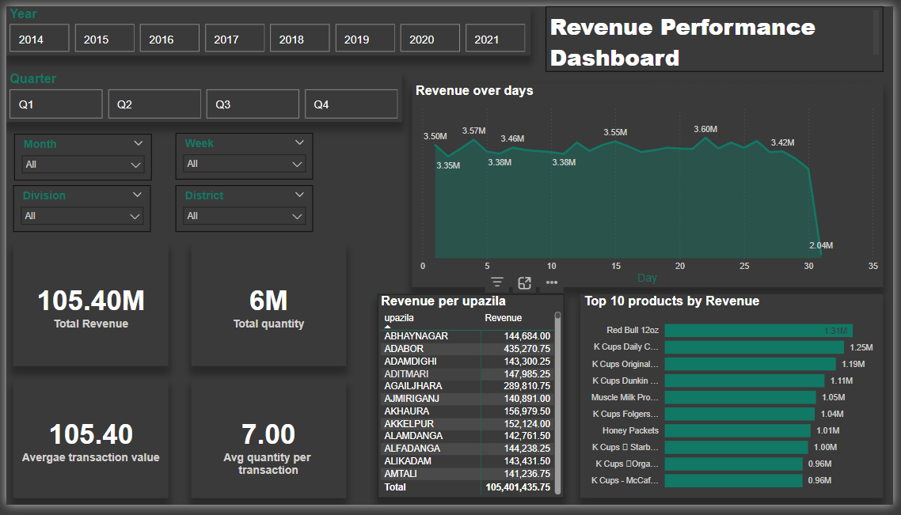

# E-commerce Data Analysis Dashboard
Can access the Dashboard here:
https://app.powerbi.com/groups/me/dashboards/fb9138fe-64d6-410e-98cf-d028aacfa1c6?ctid=080360ee-84c0-4838-925a-e124e4129a30&pbi_source=linkShare

This project involves the analysis of e-commerce sales data, where I transformed and loaded the data into a MySQL database, performed exploratory data analysis (EDA), and created an interactive dashboard for visual insights using Power BI. 
Key Performance Indicators selected here : Total Revenue, Total Quantity, Average transaction value, Average quantity per transaction

## Project Overview

1. **Data Collection:**  
   The dataset was sourced from Kaggle, which contains transactional data for an e-commerce platform, including customer, payment, store, item, and time-related details.
# **Data Schema**

3. **Data Preprocessing:**  
   I loaded the data into a Jupyter Notebook and performed the following steps:
   - Checked for and handled missing values
   - Checked data types
   - Checked for duplicates 

4. **Data Transformation & Loading:**
   - The transformed data was loaded into a MySQL database using SQLAlchemy and Python scripting.
   - I used MySQL Workbench to further interact with the data and run SQL queries.

5. **Data Analysis & Insights:**
   - Ran queries to analyze revenue, store performance, payment methods, customer behavior.

6. **Interactive Dashboard:**
   - Used Power BI to create an interactive dashboard that visualizes key metrics such as:
     - Revenue by area
     - Revenue over Time
     - Total Revenue
     - Top items

  
